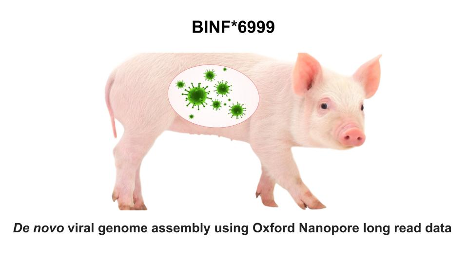

  
##Rationale:  
The efficiency and success of discovery of novel and unexpected pathogens using metagenomics
data heavily depends on the availability of bioinformatics tools to identify organisms present in
the sample. Many existing tools and approaches heavily rely on reference databases to classify
reads and assemble genomes. This approach, however, is problematic, particularly for novel
pathogens, when no closely related reference is available. Therefore, reference-free (de novo)
genome assembly methods provide an advantage of assembling contigs without relying on a
reference sequence. Additionally, long read sequencing technologies such as Oxford Nanopore
and Pacific Biosciences facilitate de novo contig assembly by generating more contiguous reads.
Long read de novo genome assemblers have been successfully used to recover complete and
nearly complete genomes of many groups of organisms such as animals, plants, bacteria;
however, their application for viral genome assembly remains challenging due to the generally
smaller genome size and lower abundance in metagenomics data. The main aim of the project
is to assess performance of various long read de novo assemblers to reconstruct viral
genomes from metagenomics data and to develop the best practices guidelines.  
  
##Project outline:  
- Get familiar with the bioinformatics tools used for de novo assembly of long reads (from
primarily Oxford Nanopore sequencing platforms)  
- Select a set of the de novo assemblers for further testing (as of now, we will primarily
focus on Flye (https://github.com/fenderglass/Flye) and Canu
(https://github.com/marbl/canu) de novo assemblers; we might add one or two other
assemblers if they come up between now and late April);  
- For each assembler, identify key parameters (settings) that can be adjusted to improve
performance of the assembler (e.g. length of read overlaps, minimum required depth of
coverage, etc.);  
- Perform a thorough benchmark assessment of the software using simulated and empirical
metagenomics datasets generated in the lab; include sensitivity testing for the key settings
identified for each assembler;  
- Summarize results indicating the best performing de novo assembly workflow for long-
read viral metagenomics
  
##Expected outcome:  
Report containing detailed results of the benchmarking tests, list of key settings identified,
recommendations for the best practices when performing de novo viral metagenomics assemblies
using Oxford Nanopore long-reads.  
